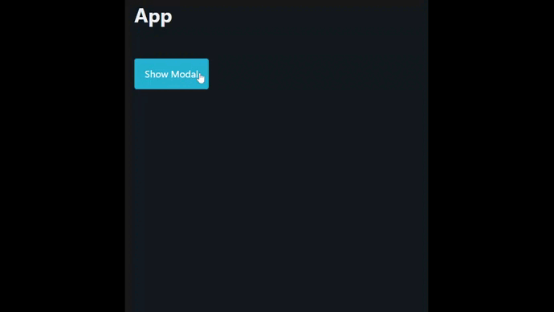

# Vue Modal Component

Two modal component with transitions using Vue's teleport feature.

Created using [Vue 3](https://vuejs.org/) and [PicoCSS](https://picocss.com/) which is a CSS framework based on Semantic HTML5 with accessibility in mind.

## Features

- Both modal components can be closed by **clicking outside** of the modal-box
- Shows aria-busy loading indicator when clicking on `Show Modal` button
- In Firefox browsers, *backdrop* filter will not work until they implement this CSS property
- It is accessible and has semantic tags
- Minimal styles and works without [PicoCSS](https://picocss.com/)

> Closing modal by pressing **escape** key is the next feature that I will add

## Benefits of Teleport (Vue 3 feature)

Teleport makes sure modal is the closed element in terms of depth because it is injected to just before the body end tag.

Compare *BaseModal* component with *TeleportModal*; when clicking on `Show Modal` button, **aria-busy loading** indicator is awefully visible on *BaseModal*. But on *TeleportModal* thanks to Vue's Teleport feature, `Show Modal` button loading will be rendered behind the `modal-wrapper` since it has a backdrop filter (blur) effect, so there is no unexpected behaviour.
